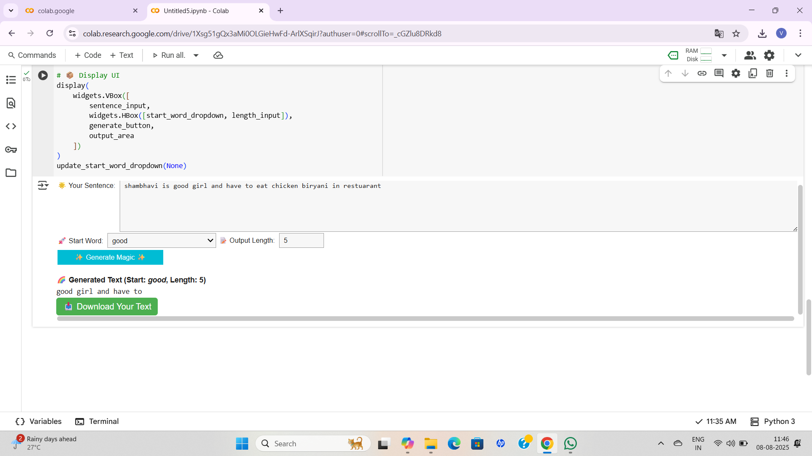

# PRODIGY_GA_03
Interactive Markov chain text generator with styled UI
# 🧠 Task-03: Markov Text Generation (Interactive & Stylish)

This project uses a simple Markov chain model to generate text based on your own input sentence. It features a fully interactive UI with dropdowns, sliders, styled output, and a download button.

---

## 🖼️ Output Screenshot



---

## 🚀 Run on Google Colab

Click the badge below to launch the notebook instantly in Colab:

[](https://colab.research.google.com/github/VinjamuriPranaya/PRODIGY_GA_03/blob/main/notebooks/markov_text_generator.ipynb)


---

## 🧪 What We Used

- `ipywidgets` for interactive UI
- Python dictionaries for Markov chain modeling
- `files.download()` for exporting generated text
- Google Colab for instant execution

---

## 📄 How to Run Locally

1. Clone the repo:
   ```bash
   git clone https://github.com/VinjamuriPranaya/PRODIGY_GA_03.git
